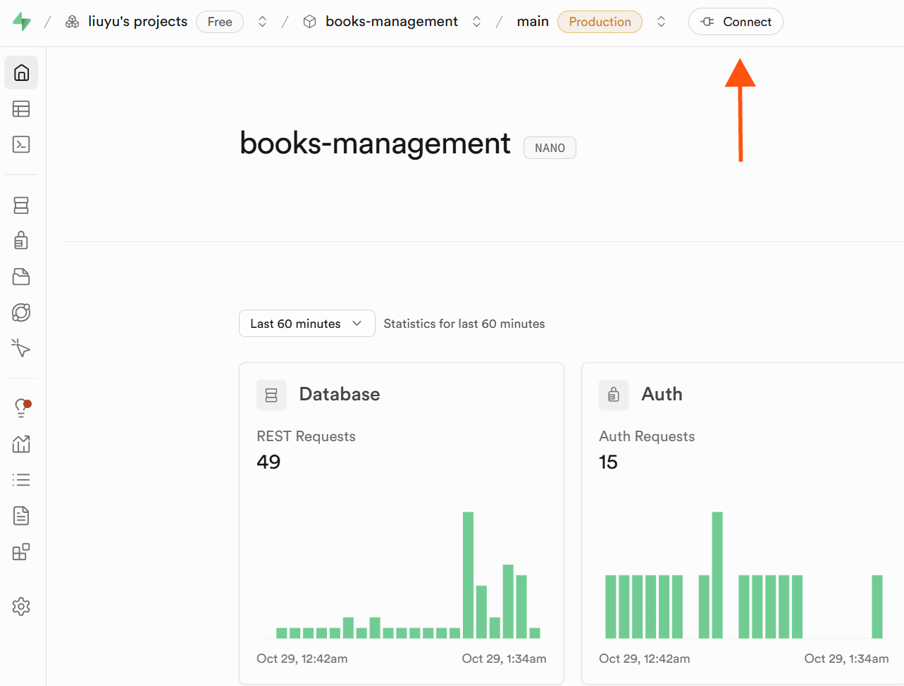
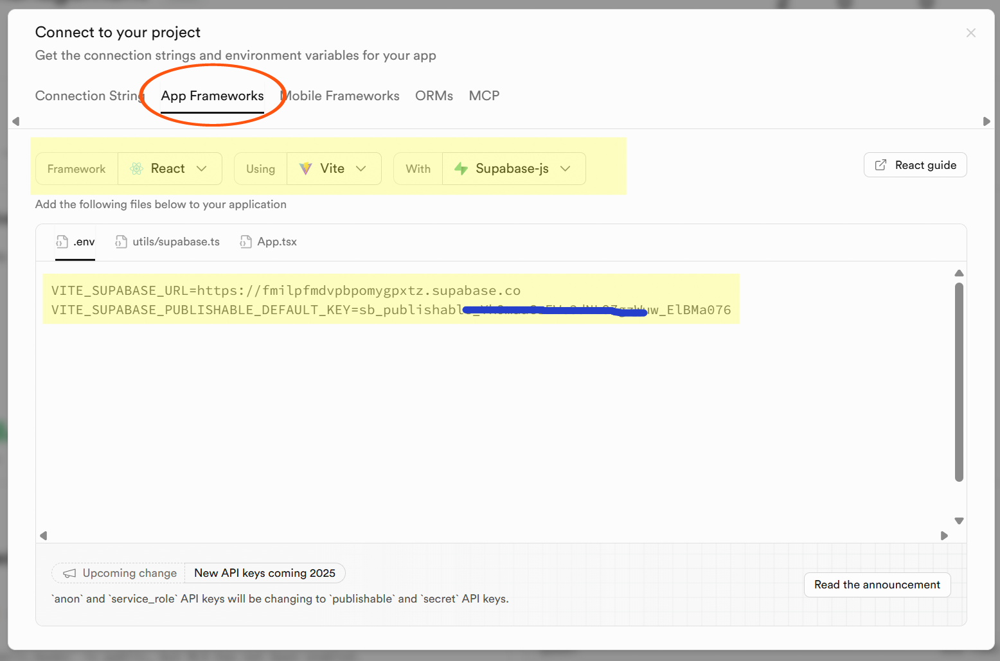

# 部署指南

本文档介绍如何部署基于 React + Supabase 的图书管理系统，包括 Supabase 项目配置、数据库表创建、RLS 策略以及前端部署流程。

## 1. 创建 Supabase 项目

1. 访问 [Supabase 官网](https://supabase.com/)，登录或注册账号。
2. 点击 **New project** 创建新项目。
3. 填写项目信息：
   - **Project name**: 例如 `books-management`
   - **Database Password**: 设置数据库密码（请妥善保存）
   - **Region**: 选择离用户最近的区域
4. 点击 **Create new project**，等待 Supabase 初始化完成（约 2 分钟）。

## 2. 配置数据库表

### 2.1 运行 SQL 脚本

1. 在 Supabase 控制台，点击左侧的 **SQL**。
2. 创建新查询，将以下 SQL 脚本复制进去并执行：

```sql
CREATE EXTENSION IF NOT EXISTS pgcrypto;

CREATE TABLE IF NOT EXISTS books (
  id UUID PRIMARY KEY DEFAULT gen_random_uuid(),
  title VARCHAR(255) NOT NULL,
  author VARCHAR(255) NOT NULL,
  isbn VARCHAR(13) UNIQUE,
  publisher VARCHAR(255),
  publication_year INTEGER,
  category VARCHAR(100),
  description TEXT,
  quantity INTEGER DEFAULT 1,
  available_quantity INTEGER DEFAULT 1,
  created_at TIMESTAMP WITH TIME ZONE DEFAULT NOW(),
  updated_at TIMESTAMP WITH TIME ZONE DEFAULT NOW()
);

CREATE INDEX IF NOT EXISTS idx_books_title ON books(title);
CREATE INDEX IF NOT EXISTS idx_books_author ON books(author);
CREATE INDEX IF NOT EXISTS idx_books_category ON books(category);
```

> 完整的数据库结构和扩展说明请参考 [DATABASE.md](./DATABASE.md)。

### 2.2 自动更新时间戳（可选）

```sql
CREATE OR REPLACE FUNCTION update_updated_at_column()
RETURNS TRIGGER AS $$
BEGIN
  NEW.updated_at = NOW();
  RETURN NEW;
END;
$$ LANGUAGE plpgsql;

CREATE TRIGGER update_books_updated_at
  BEFORE UPDATE ON books
  FOR EACH ROW
  EXECUTE FUNCTION update_updated_at_column();
```

## 3. 配置 Row Level Security (RLS)

Supabase 默认启用 RLS（行级安全）。在开发阶段可以临时禁用 RLS 以便调试，但生产环境应启用并配置策略。

### 3.1 开发环境（禁用 RLS）

```sql
ALTER TABLE books DISABLE ROW LEVEL SECURITY;
```

### 3.2 生产环境（示例策略）

```sql
ALTER TABLE books ENABLE ROW LEVEL SECURITY;

CREATE POLICY "Allow anonymous read" ON books
  FOR SELECT USING (true);

CREATE POLICY "Allow authenticated insert" ON books
  FOR INSERT TO authenticated WITH CHECK (true);

CREATE POLICY "Allow authenticated update" ON books
  FOR UPDATE TO authenticated USING (true) WITH CHECK (true);

CREATE POLICY "Allow authenticated delete" ON books
  FOR DELETE TO authenticated USING (true);
```

> 根据实际业务需求调整策略（例如仅管理员可写）。

## 4. 获取 API Key 和 URL

1. 在 Supabase 控制台，点击上方的 **Connect**。

  

2. 记录以下信息：

  

3. 将这些信息填入项目根目录的 `.env` 文件中：

```env
VITE_SUPABASE_URL=https://xyzcompany.supabase.co
VITE_SUPABASE_ANON_KEY=your-public-anon-key
```

## 5. 本地测试

```bash
npm install
npm run dev
```

访问 `http://localhost:5173`，验证应用是否能正确读取和写入 Supabase 数据。

## 6. 前端部署

以下是常见的部署平台：

### 6.1 Vercel

1. 将代码推送到 GitHub/GitLab/Bitbucket。
2. 登录 [Vercel](https://vercel.com/)，导入项目仓库。
3. 部署设置：
   - Framework preset: `Vite`
   - Build Command: `npm run build`
   - Output Directory: `dist`
4. 在 **Environment Variables** 中添加：
   - `VITE_SUPABASE_URL`
   - `VITE_SUPABASE_ANON_KEY`
5. 点击 **Deploy**，等待部署完成。

### 6.2 Netlify

1. 登录 [Netlify](https://www.netlify.com/)，关联代码仓库。
2. 部署设置：
   - Build command: `npm run build`
   - Publish directory: `dist`
3. 在 **Site settings** -> **Build & deploy** -> **Environment** 中添加环境变量。
4. 触发部署。

### 6.3 其他平台

- **Render**: 使用静态站点托管，配置同 Netlify。
- **GitHub Pages**: 使用 `npm run build` 生成静态文件并上传到 `gh-pages` 分支。

## 7. 生产环境部署流程摘要

1. 创建 Supabase 项目并初始化数据库
2. 配置 RLS 策略和 API Key
3. 配置 `.env` 并在本地测试
4. 选择部署平台（Vercel/Netlify 等）
5. 配置环境变量并部署前端

## 8. 运维建议

- 定期备份 Supabase 数据库（Supabase 自动备份 + 手动导出）
- 监控 Supabase API 使用情况，避免超出免费配额
- 定期审查 RLS 策略和 API Key
- 开启 Supabase 日志，追踪数据库操作

## 9. 故障排查

| 问题 | 可能原因 | 解决方案 |
|------|----------|----------|
| 前端无法获取数据 | 环境变量缺失 / Supabase URL 错误 | 检查 `.env` 配置并重新部署 |
| 返回 401/403 错误 | RLS 策略限制 | 调整 Supabase RLS 策略或使用服务端密钥 |
| 显示空数据 | 数据库为空 | 在 Supabase 控制台或应用中添加数据 |
| 无法访问部署站点 | 部署失败 | 查看平台日志，确认构建命令和目录是否正确 |

## 参考资源

- [Supabase 官方文档](https://supabase.com/docs)
- [Vercel 部署文档](https://vercel.com/docs)
- [Netlify 部署文档](https://docs.netlify.com/)
